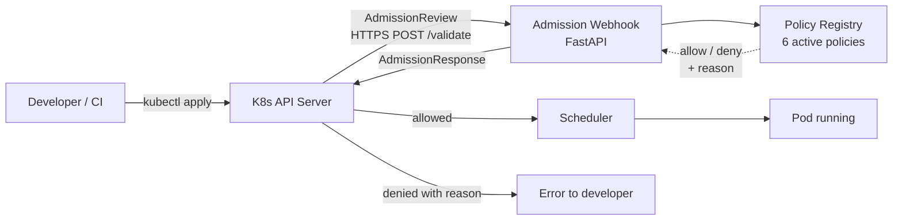

# Kubernetes Cloud-Native Security Platform

[](https://github.com/vladandrei28/k8s-security-platform/actions/workflows/ci.yml)

A Python-based **Kubernetes Validating Admission Webhook** that enforces baseline pod security policies at the API server level. Pods violating policies are rejected before scheduling, with clear error messages identifying the policy that fired.

> Built as a hands-on study in cloud-native security and Kubernetes internals. Production-grade structure with self-signed TLS, namespace-scoped enforcement, unit tests, and CI/CD.

## What it does

When a developer or CI pipeline runs `kubectl apply` for a Pod, the Kubernetes API server intercepts the request and asks this webhook whether the Pod should be admitted. The webhook evaluates the Pod spec against a registry of security policies and returns an allow/deny decision. Denied Pods never exist — they're rejected at admission with a structured error message naming the failed policy.

Six policies are enforced out of the box:

| Policy | What it blocks |
|---|---|
| `no-root` | Pods that run as UID 0 or explicitly disable `runAsNonRoot` |
| `no-privileged` | Containers with `securityContext.privileged: true` |
| `no-host-network` | Pods that share the node's network namespace |
| `no-host-pid` | Pods that share the node's PID namespace |
| `resource-limits-required` | Containers missing CPU or memory limits |
| `image-registry-allowlist` | Images from registries outside the configured allowlist |

## Architecture



The webhook serves HTTPS using a self-signed CA. The CA bundle is registered with `ValidatingWebhookConfiguration` so the API server trusts it. Enforcement is scoped via `namespaceSelector` to namespaces labeled `security-policy=enforce`, so cluster infrastructure (including the webhook itself) is not affected by the policy and cannot be locked out by misconfiguration.

## Quickstart (local development)

Prerequisites: Docker, kubectl, k3d, Python 3.11+, openssl.

```bash
# 1. Create local cluster
k3d cluster create vlad-sec --agents 1

# 2. Generate TLS certs and create Secret
./tls/gen-certs.sh
kubectl create secret tls security-webhook-tls \
  --cert=tls/server.crt --key=tls/server.key

# 3. Build image and load into cluster
cd webhook
docker build -t security-webhook:dev .
k3d image import security-webhook:dev -c vlad-sec
cd ..

# 4. Deploy the webhook
kubectl apply -f k8s/deployment.yaml -f k8s/service.yaml

# 5. Register the webhook with K8s API server
./k8s/apply-webhook-config.sh

# 6. Create a namespace where policies are enforced
kubectl create namespace policy-test
kubectl label namespace policy-test security-policy=enforce
```

## Demo

Try to create a pod running as root:

```bash
kubectl apply -n policy-test -f - <<MANIFEST
apiVersion: v1
kind: Pod
metadata:
  name: bad-pod
spec:
  securityContext:
    runAsUser: 0
  containers:
    - name: app
      image: nginx
MANIFEST
```

Expected output:
Error from server: admission webhook "validate.security-webhook.default.svc"
denied the request: [no-root] Pod-level securityContext.runAsUser is 0 (root)

The Pod never enters the cluster. The same manifest applied to the `default` namespace succeeds, demonstrating namespace scoping.

## Development

Run unit tests with coverage:

```bash
cd webhook
python3 -m venv .venv
source .venv/bin/activate
pip install -r requirements.txt -r requirements-dev.txt

pytest -v --cov=policies --cov-report=term-missing
```

Tests cover all six policies and the orchestrator (~30 cases, ~99% line coverage).

The CI pipeline (GitHub Actions) runs tests and builds the Docker image on every push and pull request.

## Project structure
```
.
├── webhook/                        # Webhook service
│   ├── main.py                     # FastAPI app + admission protocol
│   ├── policies.py                 # Policy registry and check functions
│   ├── test_policies.py            # Unit tests
│   ├── Dockerfile
│   ├── requirements.txt
│   └── requirements-dev.txt
├── k8s/                            # Kubernetes manifests
│   ├── deployment.yaml
│   ├── service.yaml
│   ├── validating-webhook.yaml.tpl # Template with CA bundle placeholder
│   └── apply-webhook-config.sh     # Renders template + applies
├── tls/                            # TLS cert generation
│   └── gen-certs.sh
├── .github/workflows/ci.yml        # CI pipeline
└── README.md
```

